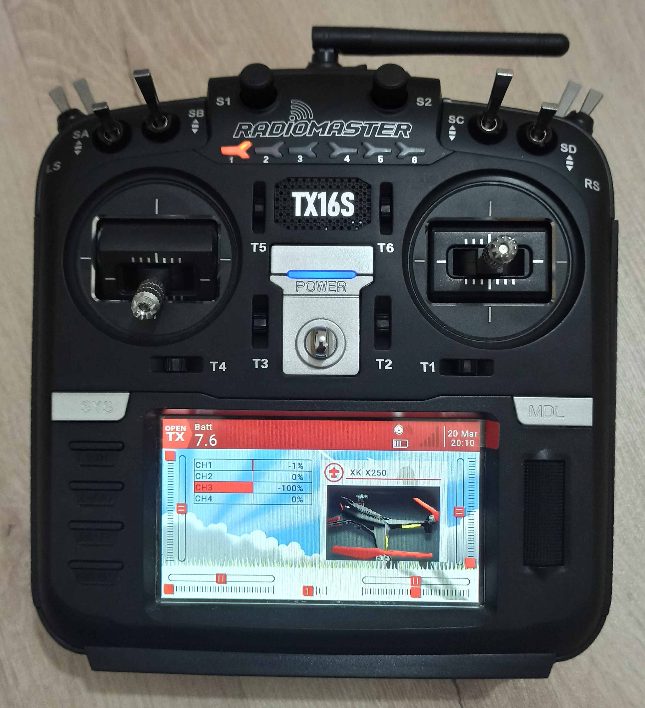

# Hazır ve Elle Yapılan Kumanda ve Hareket Sensörü ile Bir Dronun Manuel Kontrolü
## Özet

Bu çalışmada dört pervaneli bir dronun (i.e., quadcopter) manuel kontrolü için 4-kanallı bir kumanda tasarlanmıştır. El yapımı kumanda tarafında iki eksenli iki joystick tarafından üretilen dört kanal sinyali, *Arduino* mikrodenetleyicisine analog girişlerden transfer edilirken [0-5]V aralığında değişen sürekli zaman sinyali [0-1023] tam sayı aralığına kuantize edilmiştir. Elde edilen bu sayısal sinyaller *Arduino* üzerinde zamanlayıcı kullanılarak üretilen Darbe Pozisyonu Modülasyonu sinyaline dönüştürülerek [1] *Master* konumunda XK X250 dronuna bağlı bulunan *Radiomaster TX16S* kumandaya *mono jack* kablo ile bağlanmıştır. Hazır kumandanın eğitim fonksiyonu (*trainer port*) kullanılarak dronun kontrolü *Slave* durumunda bulunan el yapımı kumandaya verilmiş, böylece dronunun kontrolü elle yapılan kumanda tarafından sağlanmıştır.

## Abstract
In this study, a 4-channel hand-made controller is designed to manually control a quadcopter. Four channel signals generated by the two-axes joysticks on the hand-made controller are transferred into *Arduino* microcontroller via analog inputs (i.e., analog-to-digital converters - ADC) by quantization of [0-5]V continuous time potentiometer signals to [0-1023] integer range. Obtained digital signals are mapped to Pulse Position Modulation (PPM) signals via usage of timers on *Arduino* [1] and connected to a *Master* *Radiomaster TX16S* radio controller (with a mono-jack cable) that is bound to XK X250 drone. The off-the-shelf controller's trainer port is used to pass the control to the hand-made controller that serves as *Slave* and eventually the drone is controlled by the hand-made controller.

## Potansiyometre
Potansiyometreye **ayarlı direnç** dendiğinden daha önce bahsetmiştik. Bu devre elemanının;
* Üç bacağı olduğunu, 
* İlk ve son bacaklarına Arduino'nun Vcc (5V) ve GND pinlerinin bağlandığını, 
* Orta bacağının Arduino'nun analog girişlerinden bir tanesine (e.g., A0) bağlandığını, 
* Analogdan dijitale çevirici (Analog to Digital Converter - ADC) aracılığıyla [0-5V] aralığında sürekli (continuous) değer alabilen analog bir sinyalin, [0-1023] aralığında bir tam sayıya (integer) dönüştürülerek alındığını, 

görmüştük. Bir potansiyometreyi ve yukarıda listelenen Arduino bağlantılarını Şekil 1'de görebilirsiniz.

 

*Şekil 1: Potansiyometre ([2]'in izni ile) ve Arduino-potansiyometre bağlantıları.*
## Joystick
İçinde iki tane potansiyometre barındıran bir joystick'in resmini Şekil 2'de görebilirsiniz. Her bir potansiyometrenin üretmiş olduğu sinyale *kanal sinyali* diyeceğiz. Kendi-kendini dengeleyen robot projesinde manuel kontrol için **iki** kanala (ileri-geri ve kendi ekseni etrafında dönme (i.e., spin)), dron projesinde ise minimum **dört** kanala (i.e., yukarı-aşağı (i.e., *throttle*), kendi ekseni etrafında dönme (i.e., *rudder* veya *yaw*), sağa-sola (*aileron* veya *roll*) ve ileri-geri (*elevator* veya *pitch*)) ihtiyaç duyulmaktadır.

*Şekil 2: İki eksenli joystick ([3]'nin izni ile). VRx ve VRy olarak isimlendirilen çıkışlar Arduino'nun analog girişlerine (e.g., A0 ve A1) bağlanmaktadır.*

Şekil 2'de gösterilen iki-kanallı joystick'in beşinci bacağı **SW** olarak isimlendirilmiş olup *switch* anlamında *anahtar* vazifesi görmektedir. Joystick'in üzerine basılmadığında **HIGH** durumunda olan bu bacak basıldığı zaman **LOW** duruma geçer ve bu sinyal Arduino'ya dijital giriş olarak alınabilir1. Bu şekilde istenildiği zaman joystick'e basarak Arduino'ya işaret gönderip kanal sinyalleri için hareket sensörüne geçeceğimizi bildirebiliriz. Burada gözden kaçırılmaması gereken bir nokta VRx ve VRy bacaklarından Arduino'ya *her zaman* sinyallerin okunduğudur. Eğer joystick'e basılıp da kontrol hareket sensörüne geçse bile joystick sinyallerini Arduino'ya almaya devam ediyor olacağız. Ancak robota veya drona gönderilecek olan kanal sinyalleri joystick'den gitmiyor olabilir.
## Radiomaster TX16S Radyo Kumanda (Hazır Kumanda) ve Elle Yapılan Kumanda ve XK X250 Drone

*Şekil 3: XK X250 [4] dronuna dahili RF modülü ile bağlanmış durumdaki Radiomaster TX16S radyo kumanda.*

*Şekil 4: Radiomaster TX16S kumanda *Master* rolünde, içerisinde bir tane Arduino Pro Mini olan el-yapımı beyaz kumanda ise *Slave* rolünde. Radiomaster TX16S kumanda dahili RF modülü ile XK X250 dronuna bağlı. Trainer port ile kontrol el-yapımı kumandaya geçirilebilir ve dronun kontrolü beyaz kumanda ile yapılabilir.*

## Notlar
**Not 1:** İnternette elimizdeki Radiomaster TX16S radyo kumandanın XK X250 dronuna bağlanma (bind) videosuna rasgelmedim. Araştırırken [5]'de Jumper T16 kumandasına bağlandığı videoyu gördüm. Jumper'da Radiomaster kumanda gibi multiprotokol bir kumanda, videoya baktığımda Jumper T16'nın arayüz tasarımının Radiomaster TX16S ile nerdeyse aynı olduğunu görünce videoyu dikkatlice dinledim ve XK X250'yi Radiomaster TX16S'e bağlamayı başardım.
 
**Not 2:** Radiomaster TX16S'in trainer port ayarlarını aktif hale getirmek için [6]'ya bakabilirsiniz.
## Dipnotlar
1 Kullanılan joystick'e göre **SW** girişinin default değeri değişebilir, bu yüzden multimetre veya Arduino seri port ile push-button'a basılmadığında oluşan değeri test ediniz.
## Video
Videoları aşağıdaki resime tıklayarak izleyebilirsiniz. 
 
 

## Kaynaklar
[1] https://github.com/ElectricRCAircraftGuy/eRCaGuy_PPM_Writer 
[2] https://www.direnc.net/22k-potansiyometre-potansiyometre-spike-55641-56-B.jpg 
[3] https://market.projehocam.com/wp-content/uploads/joystick.jpg 
[4] https://www.pilottr.com/urun/xk-alien-x250-drone.html 
[5] https://www.youtube.com/watch?v=615AU5EjPjU&list=LL&index=14 
[6] https://www.youtube.com/watch?v=LYvomCtAg7g&list=LL&index=2 
